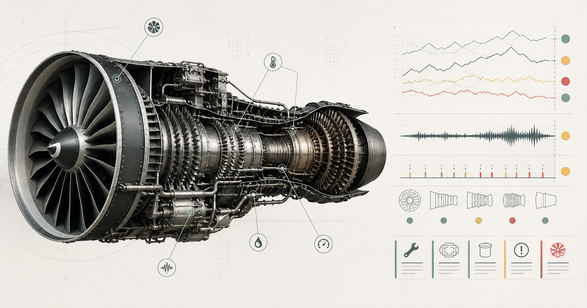

# NASA C-MAPSS Predictive Maintenance

[](https://github.com/Saroswat/nasa-cmapss-predictive-maintenance/actions/workflows/ci.yml)



A reproducible remaining-useful-life (RUL) and cost-aware maintenance workflow for NASA's C-MAPSS FD001 turbofan benchmark. This is a modernized continuation of my B.Tech eighth-semester project.

## What this project does

- Downloads the official C-MAPSS archive from NASA and verifies the FD001 file checksums.
- Builds piecewise-linear RUL targets capped at 125 cycles.
- Adds causal five-cycle rolling sensor features without using future observations.
- Keeps complete engines together during model selection to prevent train/validation leakage.
- Compares Random Forest and histogram gradient boosting regressors using NASA's asymmetric score.
- Learns a maintenance-risk classifier and selects its decision threshold from an explicit cost matrix.
- Produces predictions, metrics, trained models, and publication-ready plots.
- Presents verified fleet risk, maintenance queues, and model health in a responsive web dashboard.
- Runs on macOS, Windows, and Linux with Python 3.11 or newer.

## Quick start

### macOS Terminal

```bash
curl -fsSL https://raw.githubusercontent.com/Saroswat/nasa-cmapss-predictive-maintenance/main/scripts/setup-macos.sh | bash
```

### Windows PowerShell

```powershell
irm https://raw.githubusercontent.com/Saroswat/nasa-cmapss-predictive-maintenance/main/scripts/setup-windows.ps1 | iex
```

Both setup scripts clone this repository, install [uv](https://docs.astral.sh/uv/) when needed, create an isolated Python environment, install the Python and Node.js dependencies, and download the dataset. The dashboard requires Node.js 22.13 or newer.

To retrain the models, refresh the dashboard data, and launch the web interface as part of setup:

**macOS Terminal**

```bash
curl -fsSL https://raw.githubusercontent.com/Saroswat/nasa-cmapss-predictive-maintenance/main/scripts/setup-macos.sh -o /tmp/setup-cmapss.sh
bash /tmp/setup-cmapss.sh --run-experiment --start-dashboard
```

**Windows PowerShell**

```powershell
$setup = Join-Path $env:TEMP "setup-cmapss.ps1"
Invoke-WebRequest https://raw.githubusercontent.com/Saroswat/nasa-cmapss-predictive-maintenance/main/scripts/setup-windows.ps1 -OutFile $setup
& $setup -RunExperiment -StartDashboard
```

Omit `--run-experiment` / `-RunExperiment` for the quick setup using the committed verified dashboard snapshot. Custom repository URLs and install locations are available through `--repository-url`, `--install-directory`, `-RepositoryUrl`, and `-InstallDirectory`.

Run the complete experiment:

```bash
uv run cmapss-maintenance run
```

Open the modern notebook:

```bash
uv run jupyter lab notebooks/01_modern_predictive_maintenance.ipynb
```

Launch the fleet dashboard:

```bash
npm --prefix web run dev
```

Then open [http://localhost:3000](http://localhost:3000). The committed dashboard snapshot contains the verified FD001 results, so it works immediately after setup.

## Repository layout

```text
.
├── src/cmapss_maintenance/       Tested data, feature, model, metric, and reporting code
├── notebooks/
│   ├── 01_modern_predictive_maintenance.ipynb
│   └── archive/                  Original eighth-semester notebook
├── tests/                        Fast unit and synthetic end-to-end tests
├── scripts/                      Setup scripts and dashboard data exporter
├── web/                          Responsive fleet intelligence dashboard
├── .github/workflows/ci.yml      Cross-platform lint and test matrix
└── artifacts/                    Generated locally and excluded from Git
```

## Methodology

FD001 contains one operating condition and one high-pressure-compressor degradation mode. Training trajectories run to failure; test trajectories stop before failure and ship with a separate ground-truth RUL file.

The original notebook split individual rows after resampling. Because many rows belong to the same engine, that approach can place observations from one engine on both sides of the split and inflate validation performance. This implementation splits by `unit_number`, performs model selection only on held-out engines, and evaluates the final model on NASA's untouched FD001 test trajectories.

The regression target is capped during training to represent an early-life healthy plateau. Official test metrics use the uncapped ground truth. Maintenance decisions are based on a probability threshold optimized on held-out engines with these configurable assumptions:

| Outcome | Value |
|---|---:|
| Correctly schedule necessary maintenance | +$300,000 |
| Schedule unnecessary maintenance | -$100,000 |
| Miss necessary maintenance | -$200,000 |
| Correctly take no action | $0 |

These figures are illustrative, not operational aviation guidance. Real deployment requires airline-specific costs, safety constraints, calibrated uncertainty, drift monitoring, and certification.

## Verified FD001 results

The following results were reproduced locally from the official FD001 test truth with the default configuration:

| Regression metric | Modern pipeline | Original notebook best RF |
|---|---:|---:|
| MAE (cycles, lower is better) | **13.72** | 16.49 |
| RMSE (cycles, lower is better) | **18.77** | 21.34 |
| R² (higher is better) | **0.796** | 0.74 |
| NASA score (lower is better) | **621.68** | 868.02 |

At the 30-cycle maintenance horizon, the cost-aware policy produced 24 true positives, 67 true negatives, 8 false positives, and 1 false negative. Under the illustrative cost matrix above, that is an expected value of **$6.2 million** across the 100 test engines.

## Commands

```bash
# Download only
uv run cmapss-maintenance download

# Run with the default 300 estimators
uv run cmapss-maintenance run

# Faster development run
uv run cmapss-maintenance run --estimators 50

# Refresh the web dashboard from the latest trained artifacts
uv run python scripts/export_dashboard_data.py

# Run the web dashboard
npm --prefix web run dev

# Quality checks
uv run ruff check .
uv run pytest --cov=cmapss_maintenance
npm --prefix web run lint
npm --prefix web test
```

Generated files appear in `artifacts/`:

- `metrics.json`
- `fd001_predictions.csv`
- `fd001_models.joblib`
- `rul_predictions.png`
- `maintenance_confusion_matrix.png`
- `feature_importance.png` when supported by the selected model

## Data and citation

The dataset is downloaded from the [NASA Open Data Portal](https://data.nasa.gov/dataset/cmapss-jet-engine-simulated-data). Because NASA's legacy ZIP endpoint can be intermittently unavailable, the downloader falls back to the same FD001 files in a commit-pinned public mirror. Every downloaded file is checked against a repository-pinned SHA-256 digest. Data files are not committed to this repository.

Please cite the original benchmark:

> A. Saxena, K. Goebel, D. Simon, and N. Eklund, "Damage Propagation Modeling for Aircraft Engine Run-to-Failure Simulation," Proceedings of the First International Conference on Prognostics and Health Management, 2008.

The MIT license in this repository applies to the project code, not to NASA's dataset.

## Reproducibility notes

- Random seeds are fixed in `ExperimentConfig`.
- CI tests Python 3.11 and 3.12 on Ubuntu, Windows, and macOS.
- `uv.lock` captures the resolved cross-platform dependency graph.
- The original notebook is retained unchanged for provenance.
